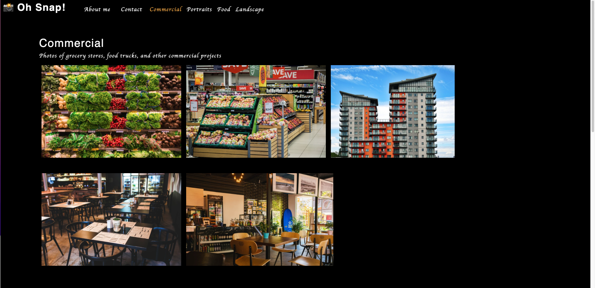

# Deep Thoughts

## Description

A single-page application that uses React to show off a ones photography skills.

## Live URL

## Usage

Go to the root directory and open up the terminal, then type `npm install` to install, this will install dependencies in the package.json file, then type the `npm start` in order to start the application

Your default web browser should open on its own but if it doesn't, open up the browser of your choice and type `localhost:3000` as the url, this will be where the application is running

You will see the portfolio site, click on any image and it will open up a modal, click on a tab and it will render different images and text content

## License

This application is not covered under any license

## Tests

Testing was done through Jest

## Technologies

The technologies used were, React, HTML, CSS, Javascript, Jest

## Contributions

By Daniel Arzanipour

## Questions

[My Github](https://github.com/DanielArzani)

If you need to reach me for any additional questions, you can reach me at my [Gmail](mailto:daniel.arzanipour@gmail.com)
